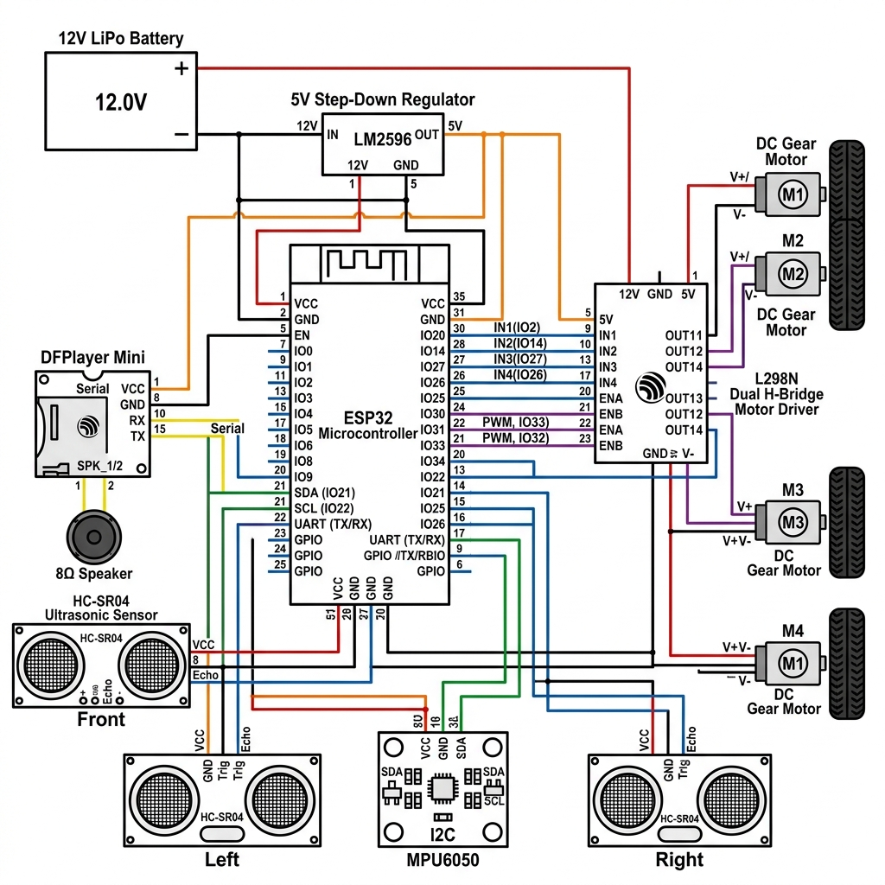

# PathFinder

PathFinder is an intelligent, self-driving autonomous vehicle (configured as a 4-wheeled mini-car platform) designed to navigate dynamically to target coordinates, chase active signal beacons, execute smart obstacle avoidance, and provide real-time voice feedback.

The system utilizes an ESP32 microcontroller with dual-core processing. One core is dedicated to high-frequency gyroscope sensor integration for a yaw-heading lock, while the second core runs the navigation control, obstacle routing, audio feedback, and the local web server.

## Motivation (Why I Built This)

I built PathFinder to explore real-time embedded systems, sensor fusion (combining IMUs and ultrasonic rangefinders), and autonomous route planning on a physical crawler. This project serves as a hands-on learning platform for understanding multi-core task scheduling (FreeRTOS) and wireless telemetry interfaces without relying on high-level microprocessors.

---

## Technical Specifications & Features

- **Gyro-Assisted Straight-Line Driving**: Utilizes an MPU6050 Inertial Measurement Unit (IMU) to track heading angle (yaw). A feedback loop adjusts motor power dynamically to correct wheel mismatches, keeping the vehicle driving perfectly straight.
- **Smart Obstacle Avoidance**: Equipped with three ultrasonic distance sensors (front, left, right) to detect path obstructions, perform emergency halts, backup, and rotate to a clear heading before resuming target navigation.
- **Beacon-Chasing Mode**: Tracks active signal sources (such as an infrared beacon or signal transmitter) using differential analog phototransistors to steer directly toward the source.
- **Wireless Coordinate Dashboard**: Hosts a local WiFi Access Point on the ESP32, serving a web dashboard where users input 2D coordinates $(X, Y)$ to command the vehicle.
- **Voice Synthesis Alerts**: Integrates a DFPlayer Mini MP3 module and a 2W speaker to vocalize status changes (e.g. playing "I am here boss, now where else do you want me to go?" upon startup).

---

## Complexity Level: Tier 3 (200 Bits | 17–33 Hours)

PathFinder fits perfectly into **Tier 3**. While the robot sits on a stable 4-wheeled platform rather than balancing, it maintains high technical complexity due to:
1. **Real-time Yaw Lock**: Using gyroscope integration to perform active straight-line correction and precise 90-degree pivot turns.
2. **Dual-Core Execution**: Splitting I2C sensor reading from web server network cycles to prevent timing lag in motor control.
3. **Multi-Sensor Integration**: Orchestrating distance sensors, target trackers, motor controllers, and UART voice feedback simultaneously.

---

## Bill of Materials (BOM)

The following components are required to assemble PathFinder:

| Component | Quantity | Estimated Price ($) | Function |
| :--- | :---: | :---: | :--- |
| [ESP32 30 Pin CP2102 Development Board](https://quartzcomponents.com/products/esp32-30-pin-development-board-with-wi-fi-and-bluetooth) | 1 | 4.62 | Main microcontroller for self-driving path planning and web dashboard hosting |
| [MPU6050 3-Axis Gyroscope and Accelerometer](https://quartzcomponents.com/products/mpu6050-gyroscope-accelerometer-sensor) | 1 | 1.87 | IMU sensor to track relative yaw heading angle for straight line driving |
| [MX1508 Dual H Bridge DC Motor Driver Module](https://quartzcomponents.com/products/mini-l298) | 1 | 0.34 | H-Bridge driver to control speed and steering direction of the DC motor |
| [GB37-555 12V DC Gear Motor 300RPM](https://quartzcomponents.com/products/gb37-555-12v-dc-gear-motor-300rpm) | 1 | 7.30 | High torque DC gear motor to drive the explorer rover chassis wheels |
| [YX5300 MP3 Voice Player Music Module](https://quartzcomponents.com/products/yx5300-mp3-player-module-voice-player-serial-control-music-module-with-tf-card-slot) | 1 | 1.86 | Hardware sound decoder to play status warnings and vocal responses |
| [OMIGA TCL 8 Ohm 10 Watt Dynamic Speaker](https://quartzcomponents.com/products/8-ohm-10-watt-omiga-tcl-speaker) | 1 | 1.67 | Dynamic speaker for vocal playback output from the MP3 card |
| [HC-SR04 Ultrasonic Sensor Module](https://quartzcomponents.com/products/hc-sr04-ultrasonic-sensor-module) | 3 | 2.59 | Ranging sensors for front left and right obstacle routing |
| [XY-3606 5A Step Down Power Supply Buck Converter](https://quartzcomponents.com/products/24v-12v-to-5v-5a-step-down-power-supply-buck-converter-xy-3606-power-convertor) | 1 | 1.66 | Steps down 11.1V battery voltage to stable 5V for the ESP32 and logic chips |
| [11.1V 4200mAh 3S 60C LiPo Rechargeable Battery](https://quartzcomponents.com/products/11-1v-4200mah-3s-60c-lithium-polymer-rechargeable-battery) | 1 | 32.35 | High capacity rechargeable power pack for driving the heavy-duty gear motors |
| [6WD All Terrain Explorer Rover Chassis Kit](https://quartzcomponents.com/products/combo-kit-of-5in1-equipment-3v-motor-9v-battery-with-on-off-switch-connector-and-propeller) | 1 | 12.99 | High mobility 6WD chassis plate kit including suspension frames and wheels |
| [MB102 Breadboard with Jumper Wires (Set of 80)](https://quartzcomponents.com/products/mb102-colored-breadboard-830-points-with-jumper-wires-male-to-male-and-male-to-female-set-of-80) | 1 | 2.09 | Prototyping board with male and female jumper wires to connect sensor pins |


---

## System Architecture & Wiring Diagram

The electrical layout routes power from the 3S LiPo battery to the motor driver, with a buck converter supplying stable 5V power to the ESP32 and logic sensors:



---

## Directory Structure

```
PathFinder/
├── .gitignore
├── LICENSE
├── CONTRIBUTING.md
├── bom.csv
├── README.md
├── schematics/
│   └── pathfinder_schematic.png
└── firmware/
    └── pathfinder_main/
        ├── pathfinder_main.ino
        └── pin_definitions.h
```

---

## Operating Instructions

1. **Upload Firmware**: Flash the ESP32 via Arduino IDE or PlatformIO with the files located in the `firmware/` directory.
2. **Access Point Setup**: Connect your mobile phone or computer to the WiFi network `PathFinder_Tesla_Mini` (Password: `admin12345`).
3. **Web Dashboard**: Open a web browser and go to `http://192.168.4.1`.
4. **Target Settings**: Input coordinate targets $(X, Y)$ on the control page to begin autonomous self-driving, or active target beacons for the car to chase.
